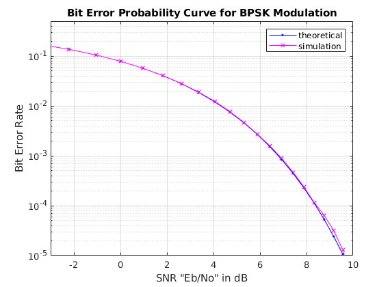
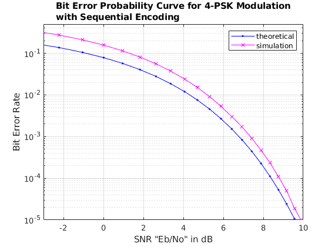
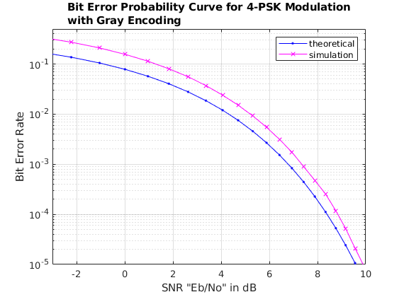
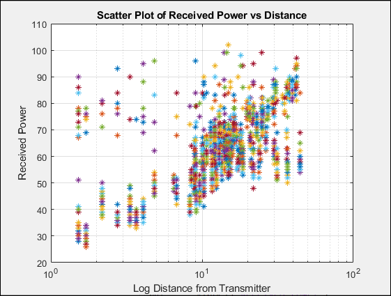
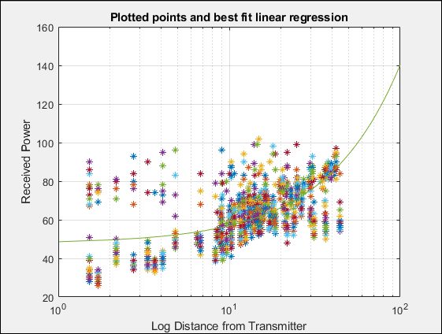

# ee597-assignment1
Modeling bit error with M-PSK and fitting the simple path loss model to collected data.

## Sources
* bit error for various schemes in matlab: https://www.mathworks.com/help/comm/ug/bit-error-rate-ber.html#fp12932
* bit error calculation theory: https://www.unilim.fr/pages_perso/vahid/notes/ber_awgn.pdf
  
## Results and Comments

### Problems 1 and 2 - Simulated Modulation Schemes (BPSK and 4-PSK)

**Figure 1** - Probability of Error for BPSK Modulation

By plotting simulation of BPSK, we can see that the sumulated error curve (with respect to
SNR) stays very close to the theortical expression curve. This is because the theoretical expression
Pb = Q(sqrt(2*SNR)), where SNR = Eb/N0, is an accurate approximation for the BPSK bit error rate (BER).

**Figure 2** - Probability of Error for 4-PSK Modulation with Sequential Encoding

However, as we can see after plotting 4-PSK over the same SNR range, the 4-PSK simulated BER for sequential encoding
follows the  same order as the theoretical expression given for BPSK, but with a higher y-intercept. This is 
because the BPSK theoretical expression is an adequate approximation for 4-PSK, but [not as accurate](https://www.unilim.fr/pages_perso/vahid/notes/ber_awgn.pdf) 
as it is for BPSK. 

**Figure 3** - Probability of Error for 4-PSK Modulation with Gray Encoding

We can make a slight improvement on the behavior of 4-PSK by changing our encoding scheme to gray-coding. This
minimizes our chance of 2-bit errors, and as we can see on the resulting plot, the simulated BER converges
to the theoretical BER at higher SNRs.

### Problem 3 -  Determining Model Parameters of the Simple Path Loss Model

**Figure 4** - Data Scatter Plot

**Figure 5** - Regression Line to Find Model Parameters

**B) Parameters** 

Paremeters contained in the [coeffs](p3.m#L613)  variable. 

K = 47.6988 (y-intercept)
N "eta" = 0.9264 (slope) 

Keep in mind all experimental values were negative, and so these
are similarly negative in real life, in line with a decreasing Received
Power with increasing distance.

**C) Standard Deviation**

There are 96 values for standard deviation, in line with the 96
different 12 experiments * 8 receivers.  Values can be found in the variable
[sd](p3.m#L613).
First few terms pulled with [bfg(:,1) sd']:
    8.9200    4.5238
    9.0504   10.6344
   23.6733    4.4869
   36.4862    9.8520
   17.8566    3.0887
   30.5840       NaN
   41.7016       NaN
   12.3894    2.9205
   15.3300    3.7573
    2.7483   18.6356
   17.2697    8.4716

**D) Missing Samples**

By leaving out samples corresponding to lost packets (-500 dBm in data),
we are biasing out results. Because packets received below a power
threshold are a valid occurrence in the real world, yet we are tossing
these as outliers in our experimental analysis, we are actually tightening
the standard deviation and analyzing only the successful
packets. With as many outliers as we saw in the experimental data, our
standard deviation would be much larger.  